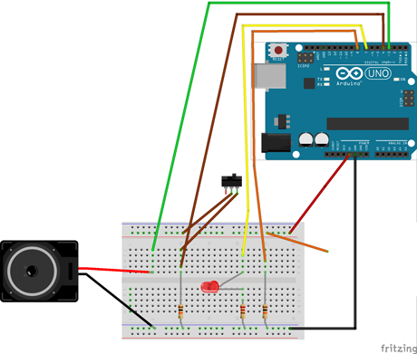
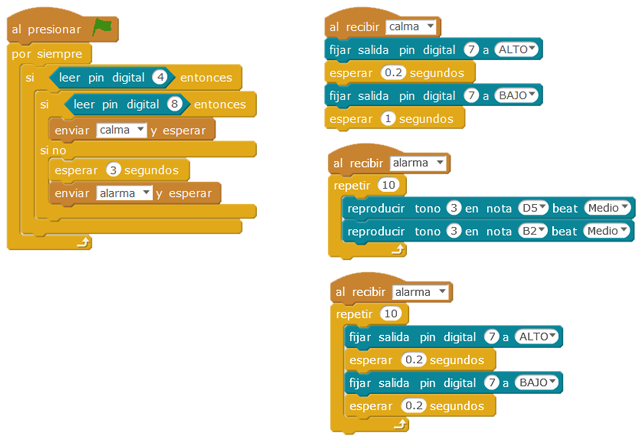

# Alarma personal

Con esta práctica fabricamos una alarma que el alumno puede utilizar personalmente en su habitación o en una caja de seguridad. Lógicamente tenemos un tiempo para desactivar esta alarma y se supone que lo haremos con un interruptor oculto. La alarma se activará al separar un contacto que se pondría en la puerta a proteger.

| Autor de la práctica |
| :---                 |
| Pedro José Fernández |

---

  

## Materiales

- 1 Placa de Arduino
- 1 Protoboard
- Altavoz
- Interruptor
- Diodo led
- Resistencia 220Ω
- 2 Resistencia 10KΩ 
- 10 Cables de conexión

  

## Esquema eléctrico

Tenemos un diodo LED polarizado que nos avisa de que la alarma está activada o funcionando. La alarma la activamos un una tensión positiva desde un divisor de tensión, a través de un interruptor.

La alarma comienza a funcionar tras tres segundos necesarios para poder desconectarla. El disparo de la alarma se provoca cuando cortamos la entrada de una señal. Esto lo simulamos desconectando el cable de alimentación del segundo divisor de tensión.  

  

## Programación en mBlock

Creamos dos eventos:
-	Calma: cuando la alarma está activada pero no se ha disparado. 
-	Alarma: La alarma suena diez ciclos. Durante este tiempo el diodo parpadea con mayor frecuencia.

Hemos dejado 3 segundos antes de que la alarma se dispare pero puede aumentarse este tiempo.

