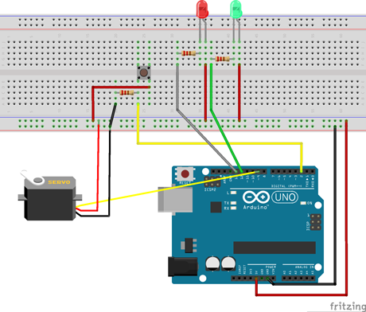
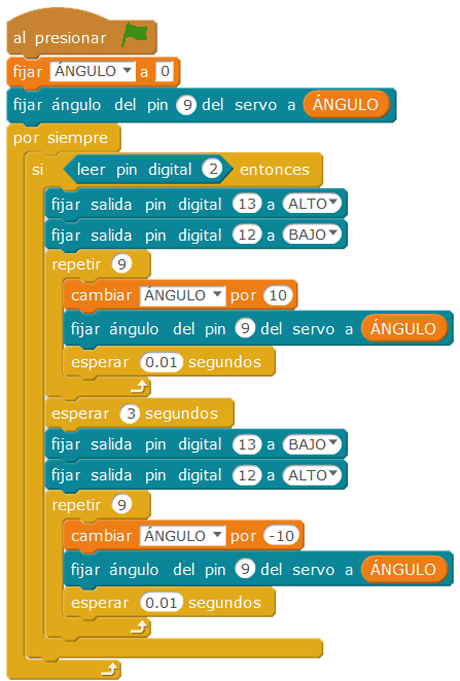

# Barrera accionada por pulsador

Se ha construido una maqueta de una barrera levadiza accionada con pulsador (control de acceso, por ejemplo de vehículos); si se acciona éste, la barrera se eleva y deja pasar el vehículo, indicando con una luz verde que la barrera está abierta, y al dejar de pulsar la barrera baja quedando una luz roja indicando que está cerrada.

| Autor de la práctica |
| :---                 |
| Antonio Martínez Hernández |
| Heriberto Martínez Martínez |

---

  

## Materiales

- 1 Placa de Arduino
- 1 Protoboard
- 2 Leds
- 1 Servomotor
- Latiguillos
- 2 Resistencias de 220Ω (rojo-rojo-marrón)
- 1 Resistencia de 10KΩ (marrón-negro-naranja)
- 1 Pulsador

  

## Esquema eléctrico

Es importante colocar las resistencias en serie con los leds, para evitar sobretensiones que puedan dañarlos, en este caso el interruptor debe estar conectado con un divisor de tensión (pull down).

  

## Programación en mBlock

Se ha creado una variable llamada ángulo, que debe de oscilar en valores entre 0º y 90º , y en algunos casos puede ocurrir que los valores oscilen entre 0 º y 180º.

