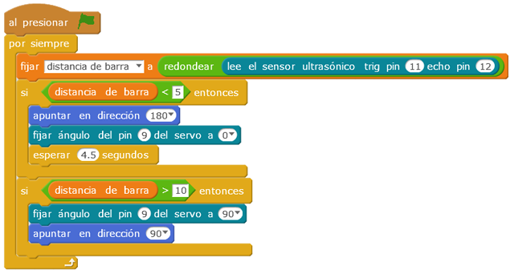

# Barrera de aparcamiento

La práctica consiste en una barrera de aparcamiento, que sube cuando un detector de ultrasonidos detecta un objeto a menos de una distancia prefijada. La barrera es accionada por un servomotor y además se visualiza en pantalla el mismo movimiento que el del montaje. En la pantalla de mblock también se visualiza la distancia medida por el detector de ultrasonidos.

| Autor de la práctica |
| :---                 |
| Alfredo Velázquez Marín |

---

  

## Materiales

- 1 Placa de Arduino
- 1 Protoboard
- 1 Sensor ultrasónico HC-SR4 
- 1 Miniservo
- 9 latiguillos

  

## Esquema eléctrico

Llevamos la tensión de 5V y GND de la placa arduino a la protoboard. Fijándonos en los pines del sensor de ultrasonidos, se conecta el pin Vcc a la línea de positivo de la placa y el GND a la de negativos y los pines triger y echo a los pines 12 y 11 respectivamente.
Conectamos el cable rojo (positivo del servomotor) a la línea de positivo de la placa y  el cable negro (negativo del servomotor) a la línea de negativos y el color amarillo al pin analógico PWM 9 de la placa de arduino.

  

## Programación en mBlock

Se crea la variable “distancia de barra” que será la que guarde el valor de la lectura del sensor y después con un condicional veremos si esa distancia es inferior a la fijada. El servo girará 90º dependiendo de la distancia medida.

