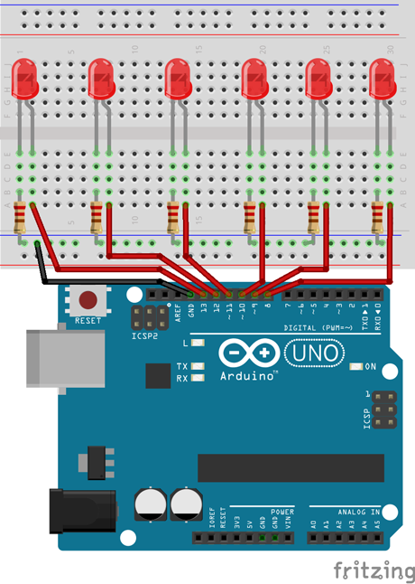
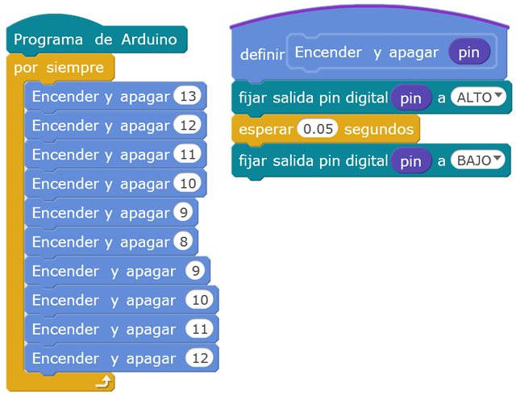

# Luces del coche fantástico

El objetivo de esta práctica es programar el efecto de las luces del coche fantástico utilizando 6 diodos LEDs de color rojo. Las luces realizarán el efecto de desplazamiento desde la izquierda hasta la derecha y desde la derecha hasta la izquierda nuevamente.


---


<br><br>


## Materiales

- 1 Arduino UNO
- 1 Protoboard
- 7 Latiguillos
- 6 LEDs
- 6 Resistencias de 220Ω (rojo-rojo-marrón)


<br><br>


## Esquema eléctrico

| Características LED              |        |
| -------------------------------- | ------ |
| Polarizado                       | Sí     |
| Intensidad de Corriente          | 20mA   |
| Tensión Led (verde, ámbar, rojo) | 2.1V   |
| Tensión Led blanco               | 3.3V   |

**Cálculo de la resistencia para el LED**

```
V = 5V - 2.1V = 2.9V
I = 20mA

V = I x R ; R = V / I

R = 2.9V / 0.02A = 145Ω -> 220Ω (por aproximación)
```

Se conecta el LED al pin digital 13 de la placa de arduino (utilizando su debida resistencia). La patilla larga del LED debe ser conectada al voltaje positivo (ánodo) y la corta al voltaje negativo (cátodo) pasando por la resistencia.




<br><br>


## Programación en mBlock

Al ejecutar el código se encenderán los LEDs en orden. Para ello se ha creado una función encargada de encender y apagar el LED correspondiente pasado por parámetro a la función.




<br><br>


## Programación en Arduino

Para la programación en Arduino IDE se ha utilizado una array que contiene los pines que se van a utilizar (desde el 13 hasta el 8).

En la función setup() se inicializa cada pin a modo salida utilizando un bucle. En la función loop() de forma similar se activan y desactivan los diferentes pines dejando un retardo entre luces.

```
/**
 * Coche fantástico
 * 
 * @author Miguel Ángel Abellán
 * @company Programo Ergo Sum
 * @license Creative Commons. Reconocimiento CompartirIgual 4.0
 */

const byte led[] = {13, 12, 11, 10, 9, 8};

void setup() {
  for (int i=0; i<sizeof(led); i++) {
    pinMode(led[i], OUTPUT);
  }
}

void loop() {
  for (int i=0; i<sizeof(led); i++) {
    digitalWrite(led[i], HIGH);
    delay(100);
    digitalWrite(led[i], LOW);
  }
  for (int i=sizeof(led)-1; i>0; i--) {
    digitalWrite(led[i], HIGH);
    delay(100);
    digitalWrite(led[i], LOW);
  }
}
```