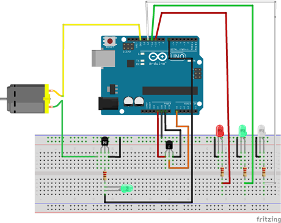
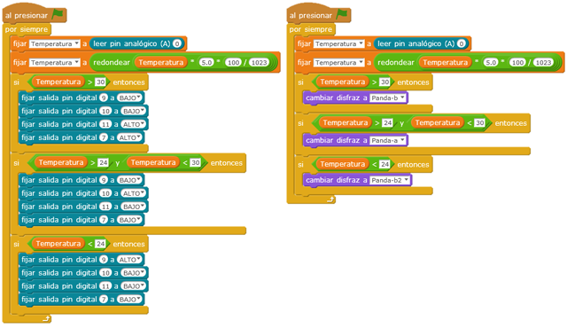

# Extractor con sensor de temperatura

Sistema para refrigerar estancias cuando superan una determinada temperatura. A mayor temperatura de la programada se acciona el mecanismo formado por un motor y hélice refrigerando la estancia y para menores temperaturas se detiene el ventilador. También incluye un led para indicar temperaturas bajas.

| Autores de la práctica |
| :---                 |
| Gerónimo Carbonell Capel |
| Pascual Banegas Gil |

---

  

## Materiales

- 1 Placa de Arduino
- 1 Protoboard
- Leds ( rojo, verde y blanco )
- Resistencias 220 Ohmios
- Sensor de temperatura LM35DZ
- Extractor (motor y hélice )
- Transistor BC547
- Diodo 1N4004
- Latiguillos de conexión

  

## Esquema eléctrico

La salida digital 13 al pasar la temperatura seleccionada leída por la entrada analógica 0 se pone a HIGH y el transistor pasa a saturación, haciendo que arranque el motor y se encienda la salida digital 11 del led rojo.

Si la temperatura se encuentra entre las seleccionadas, la salida digital 13 pasa a LOW y el transistor trabaja en corte, el ventilador se para y se enciende la salida digital 10 del led verde. Si la temperatura es menor que el límite seleccionado, la salida digital 9 del led blanco se enciende.

  

## Programación en mBlock

