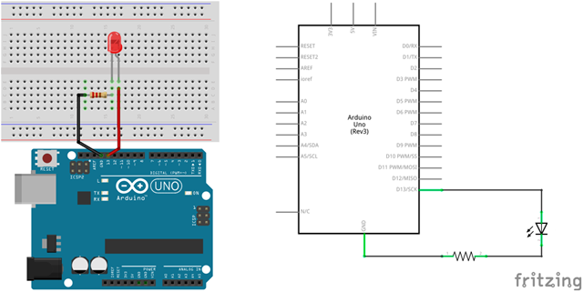

# Práctica 1: Luz intermitente

El objetivo de esta práctica es programar un LED que parpadeé de forma intermitente con una frecuencia de 1 segundo, es decir, se va a programar un código encargado de encender y apagar un LED (haciendo uso de la salida digital).


---


<br><br>


## Materiales

- 1 Arduino UNO
- 1 Protoboard
- 2 Latiguillos
- 1 LED
- 1 Resistencias de 220Ω (rojo-rojo-marrón)


<br><br>


## Esquema eléctrico

| Características LED              |        |
| -------------------------------- | ------ |
| Polarizado                       | Sí     |
| Intensidad de Corriente          | 20mA   |
| Tensión Led (verde, ámbar, rojo) | 2.1V   |
| Tensión Led blanco               | 3.3V   |

**Cálculo de la resistencia para el LED**

```
V = 5V - 2.1V = 2.9V
I = 20mA

V = I x R ; R = V / I

R = 2.9V / 0.02A = 145Ω -> 220Ω (por aproximación)
```

Se conecta el LED al pin digital 13 de la placa de arduino (utilizando su debida resistencia). La patilla larga del LED debe ser conectada al voltaje positivo (ánodo) y la corta al voltaje negativo (cátodo) pasando por la resistencia.




<br><br>


## Programación en mBlock

Al ejecutar el código se deberá establecer en el pin digital 13 un valor alto, esperar 1 segundo, establecerse un valor bajo y volver a esperar. Este procedimiento se deberá repetir indefinidamente.


<br><br>


## Programación en Arduino

En primer lugar, se configura el pin digital 13 en modo salida (OUTPUT). Esta configuración se establece en la función setup(), ya que solamente se ejecuta una vez.

Por otro lado, al ejecutar el código se deberá establecer en el pin digital 13 un valor alto (HIGH), esperar 1 segundo (1000 milisegundos), establecerse un valor bajo (LOW) y volver a esperar. Este procedimiento se realiza en la función loop() ya que se repite indefinidamente.

```
/**
 * Luz intermitente
 * 
 * @author Miguel Ángel Abellán
 * @company Programo Ergo Sum
 * @license Creative Commons. Reconocimiento CompartirIgual 4.0
 */

void setup() {
	pinMode(13, OUTPUT);
}

void loop() {
	digitalWrite(13, HIGH);
	delay(1000);
	digitalWrite(13, LOW);
	delay(1000);
}
```


---


<br>
Esta obra está bajo una licencia de [Creative Commons Reconocimiento-CompartirIgual 4.0 Internacional](https://creativecommons.org/licenses/by-sa/4.0/deed.es_ES).