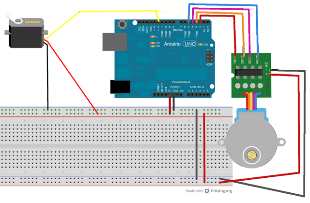

# Máquina para dibujar

Este trabajo trata sobre la construcción de una máquina para hacer dibujos conjugando los movimientos de un motor paso a paso y un servo motor. 


| Autor de la práctica |
| :---                 |
| José Antonio Torrecillas Moya |

---


<br><br>


## Materiales

- 1 Placa de Arduino nano
- 1 Protoboard
- 1 motor paso a paso 28BYJ-48.
- 1 SG90 Micro Servo 9G
- 2 abrazaderas de plástico.
- Madera y tornillería.
- Cables


<br /><br />


## Esquema eléctrico

El servo y el motor paso a paso pueden alimentarse directamente de arduino porque en esta aplicación no consumen mucha energía. Sin embargo, lo más recomendable es alimentarlos desde una fuente externa de 5V, como un cargador viejo. En tal caso, los negativos de arduino y de la fuente tienen que estar interconectados.programación en mblock y Arduino IDE (Opcional)




<br /><br />


## Programación en Arduino

Esta práctica no se puede programar en mBlock porque no es capaz de mover el motor paso a paso. Por tanto, la programación se hará solo en Arduino IDE. 

```cpp+lineNumbers:true
/**
 * Máquina para dibujar
 */

#include <Servo.h>
Servo servo;
int angulo1=0;   //águno del servo
int angulo2=180; //águno del servo
int retardo=2;
int x=0;

void setup(){
    pinMode(2,OUTPUT);
    pinMode(3,OUTPUT);
    pinMode(4,OUTPUT);
    pinMode(5,OUTPUT);
    pinMode(12,OUTPUT);
    servo.attach(9);
    Serial.begin(9600);
}
void loop(){
    movimiento2();
}

void movimiento1(){
    miservo();
    for(int i=0;i<=random(1024);i++){
        vueltaAdelante();
        tone(12,random(20,20000),20);
        x=x+1;
        Serial.println(x);
    }
    miservo();
    for(int i=0;i<=random(1024);i++){
        vueltaAtras();
        tone(12,random(20,20000),20);
        x=x-1;
        Serial.println(x);
    }
}

void movimiento2(){
    miservo();
    for(int i=0;i<=random(1024);i++){
        vueltaAdelante();
        tone(12,random(20,20000),20);
        x=x+1;
        Serial.println(x);
    }
}

void vueltaAdelante(){
  digitalWrite(2,1);
  digitalWrite(3,0);
  digitalWrite(4,0);
  digitalWrite(5,0);
delay(retardo);
  digitalWrite(2,1);
  digitalWrite(3,1);
  digitalWrite(4,0);
  digitalWrite(5,0);
delay(retardo);
  digitalWrite(2,0);
  digitalWrite(3,1);
  digitalWrite(4,0);
  digitalWrite(5,0);
delay(retardo);
  digitalWrite(2,0);
  digitalWrite(3,1);
  digitalWrite(4,1);
  digitalWrite(5,0);
  delay(retardo);
  digitalWrite(2,0);
  digitalWrite(3,0);
  digitalWrite(4,1);
  digitalWrite(5,0);
delay(retardo);
  digitalWrite(2,0);
  digitalWrite(3,0);
  digitalWrite(4,1);
  digitalWrite(5,1);
delay(retardo);
  digitalWrite(2,0);
  digitalWrite(3,0);
  digitalWrite(4,0);
  digitalWrite(5,1);
delay(retardo);
  digitalWrite(2,1);
  digitalWrite(3,0);
  digitalWrite(4,0);
  digitalWrite(5,1);

delay(retardo);
}

void vueltaAtras(){
  digitalWrite(2,1);
  digitalWrite(3,0);
  digitalWrite(4,0);
  digitalWrite(5,0);
delay(retardo);
  digitalWrite(2,1);
  digitalWrite(3,0);
  digitalWrite(4,0);
  digitalWrite(5,1);
delay(retardo);
  digitalWrite(2,0);
  digitalWrite(3,0);
  digitalWrite(4,0);
  digitalWrite(5,1);
delay(retardo);
  digitalWrite(2,0);
  digitalWrite(3,0);
  digitalWrite(4,1);
  digitalWrite(5,1);
  delay(retardo);
  digitalWrite(2,0);
  digitalWrite(3,0);
  digitalWrite(4,1);
  digitalWrite(5,0);
delay(retardo);
  digitalWrite(2,0);
  digitalWrite(3,1);
  digitalWrite(4,1);
  digitalWrite(5,0);
delay(retardo);
  digitalWrite(2,0);
  digitalWrite(3,1);
  digitalWrite(4,0);
  digitalWrite(5,0);
delay(retardo);
  digitalWrite(2,1);
  digitalWrite(3,1);
  digitalWrite(4,0);
  digitalWrite(5,0);
delay(retardo);
}

void miservo(){
  for(int i=angulo1;i<=random(angulo2);i+=1){
    servo.write(i);
    delay(retardo*2);
    
  }
  for(int i=angulo2;i>=random(angulo1);i-=1){
    servo.write(i);
    delay(retardo*2);
  }
}
```