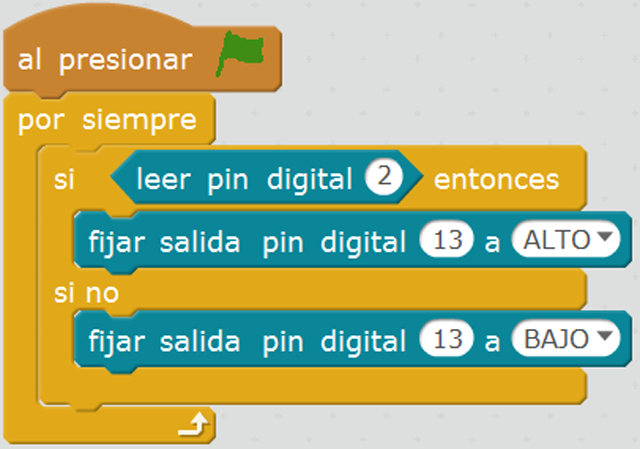

# Encender un LED mediante pulsador

El objetivo de esta práctica es encender un LED utilizando un simple pulsador, es decir, se va a programar un código encargado de detectar si se pulsa el pulsador (haciendo uso de la entrada digital), en cuyo caso se encenderá el LED (haciendo uso de la salida digital). Para ello se va a construir un circuito utilizando un LED y un pulsador.


| Autor de la práctica |
| :---                 |
|   [Miguel Ángel Abellán](https://github.com/migueabellan) |

---


<br><br>


## Materiales

- 1 Arduino UNO
- 1 Protoboard
- 4 Latiguillos
- 1 LED
- 1 Resistencia de 220Ω (rojo-rojo-marrón)
- 1 Resistencia de 10KΩ (marrón-negro-naranja)


<br /><br />


## Esquema eléctrico

| Características LED              |        |
| -------------------------------- | ------ |
| Polarizado                       | Sí     |
| Intensidad de Corriente          | 20mA   |
| Tensión Led (verde, ámbar, rojo) | 2.1V   |
| Tensión Led blanco               | 3.3V   |

**Cálculo de la resistencia para el LED**

```
V = 5V - 2.1V = 2.9V
I = 20mA

V = I x R ; R = V / I

R = 2.9V / 0.02A = 145Ω -> 220Ω (por aproximación)
```

Por un lado se conecta el LED al pin digital 13 de la placa de arduino (utilizando su debida resistencia). Por otro lado, se conecta el pulsador al pin digital 2 de la placa de arduino (utilizando la resistencia en modo Pull-Down).


<br /><br />


## Programación en mBlock

Al ejecutar el código se deberá detectar en todo momento si se ha pulsado el pulsador conectado al pin digital 2, en cuyo caso se establecerá el valor alto al pin digital 13, el cual está conectado al LED.




<br /><br />


## Programación en Arduino

En primer lugar, se configura el pin digitales 13 en modo salida (OUTPUT) y el pin digital 2 en modo entrada (INPUT). Esta configuración se establece en la función setup(), ya que solamente se ejecuta una vez.

Al ejecutar el código se deberá detectar en todo momento si se ha pulsado el pulsador conectado al pin digital 2, en cuyo caso se establecerá el valor alto al pin digital 13, el cual está conectado al LED.

```cpp+lineNumbers:true
/**
 * Pulsador simple
 */

void setup() {
    pinMode(13, OUTPUT);
    pinMode(2, INPUT);
}

void loop() {
    if (digitalRead(2) == HIGH) {
        digitalWrite(13, HIGH);
    }
    else {
        digitalWrite(13, LOW);
    }
}
```