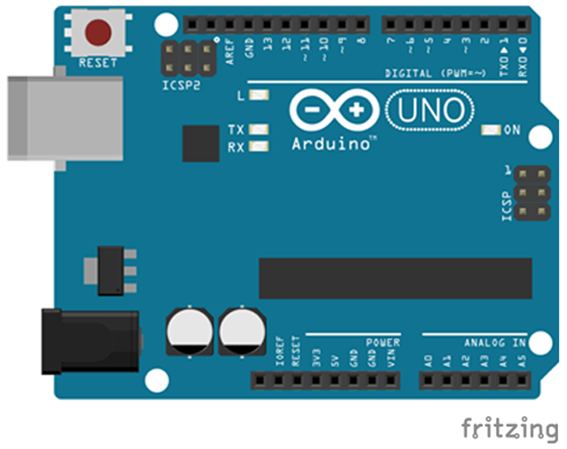

# Hola Mundo


En esta práctica se va a programar el primer programa que encenderá y apagará el led incorporado en la placa de Arduino con una frecuencia de 1 segundo.

1.	[Materiales](#materiales)
2.	[Esquema eléctrico](#esquema-eléctrico)
3.	[Programación en mBlock](#programación-en-mblock)
4.	[Programación en Arduino](#programación-en-arduino)


---


<br><br>


## Materiales

Para llevar a cabo la práctica vamos a necesitar los siguientes componentes:
- 1 Placa de Arduino UNO


<br><br>


## Esquema eléctrico




<br><br>


## Programación en mBlock


<br><br>


## Programación en Arduino

```
/**
 * Hola Mundo
 * 
 * En esta práctica se va a programar el primer programa que encenderá y 
 * apagará el led incorporado en la placa de Arduino con una frecuencia de 
 * 1 segundo.
 * 
 * @author Miguel Ángel Abellán
 * @company Programo Ergo Sum
 * @license Creative Commons. Reconocimiento CompartirIgual 4.0
 */

void setup() {
  // Configuramos el pin en modo salida
  pinMode(13, OUTPUT);
}

void loop() {
  digitalWrite(13, HIGH);
  delay(1000);
  digitalWrite(13, LOW);
  delay(1000);
}
```


---


<br>
Esta obra está bajo una licencia de [Creative Commons Reconocimiento-CompartirIgual 4.0 Internacional](https://creativecommons.org/licenses/by-sa/4.0/deed.es_ES).