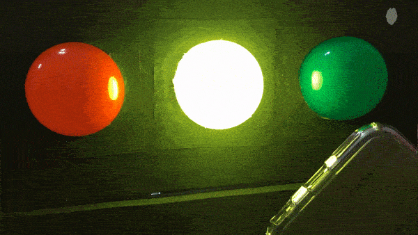
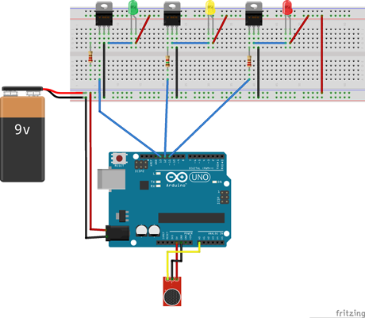

# Semáforo con micrófono

Este proyecto versa sobre un semaforo para el control del ruido en el aula, con el objetivo de concienciar y enseñar al alumnado a controlar el nivel generado, principalmente durante el desarrollo de actividades en las cuales los alumnos deben trabajar en equipo, debatiendo entre ellos, pero conservando un nivel de ruido aceptable en el aula.

| Autores de la práctica |
| :---                 |
| Sergio Lino Ferrández Gil |
| Ana Meseguir García |

---

  

## Materiales

- 1 Placa de Arduino
- 1 Protoboard
- 3 bombillas Led (verde, ámbar y roja) 
- 3 resistores 1,6K
- Módulo sensor de sonido KY-038
- 3 transistores TIP 120
- cables

  

## Esquema eléctrico

Puede conectarse a una fuente de alimentación de 9Vcc conectada a la red. Se ha realizado una placa de potencia a base de transistores para el gobierno mediante el Arduino de las lámparas LED que han sido modificadas para que funcionen a 9V de corriente continua.

  

## Programación en mBlock

El programa de mBlock se ha realizado para que detecte 3 umbrales de sonido y active cada una de las bombillas de color verde, ámbar y rojo. El color activado se mantendrá unos segundos encendido o hasta que se baje el ruido ambiente del umbral establecido.

