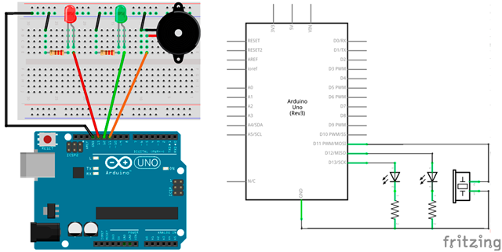

# Semáforo peatones


En esta práctica se va a programar el código de un semáforo de peatones con zumbador. Para ello se va a programar un parpadeo del zumbador mientras la luz verde esté encendida.

1.	[Materiales](#materiales)
2.	[Esquema eléctrico](#esquema-eléctrico)
3.	[Programación en mBlock](#programación-en-mBlock)
4.	[Programación en Arduino](#programación-en-arduino)


---


<br><br>


## Materiales

Para llevar a cabo la práctica, vamos a necesitar los siguientes materiales:
- 1 Placa de Arduino UNO
- 1 Protoboard
- 5 latiguillos
- 2 Diodo Led
- 2 Resistencia de 220Ω
- 1 Zumbador


<br /><br />


## Esquema eléctrico

Teniendo en cuenta las características técnicas de los diodos led que utilizamos en esta práctica, calculamos la resistencia del circuito aplicando la Ley de Ohm.

| Diodos Led                       |        |
| -------------------------------- | ------ |
| Polarizado                       | Sí     |
| Diámetro                         | 5mm    |
| Itensidad de Corriente           | 20mA   |
| Tensión Led (verde, ámbar, rojo) | 2,1V   |
| Tensión Led blanco               | 3,3V   |

| Zumbador piezo-eléctrico         |       |
| -------------------------------- | ----- |
| Polarizado                       | Sí    |
| Tensión de trabajo               | 3-12V |


```
V = 2,9V
I = 20mA

V = I x R ; R = V / I

R = 2,9V / 0,02A = 145Ω 
```

Se conectan los componentes sobre la placa de prototipado.




<br /><br />


## Programación en mBlock

Para realizar la práctica utilizando mBlock, deberás haber configurado y cargado el firmware que hace de intermediario entre la placa y el programa mBlock. En el bucle principal del programa se ha programado el encendido y apagado de los led. Dentro del bucle se ha creado un evento encargado de hacer sonar el zombador. En este evento puedes observar que se reproducirá el sonido de encendido y apagado 10 veces.


<br /><br />


## Programación en Arduino

Para programar el código utilizando el lenguaje de programación de Arduino IDE, recuerda elegir el puerto correcto. El siguiente paso será programar el código encargado de hacer que funcione el semáforo para peatones.

```
/**
 * Semáforo peatones
 *
 * @author Miguel Ángel Abellán
 * @company Programo Ergo Sum
 * @license Creative Commons. Reconocimiento CompartirIgual 4.0
 */

void setup() {
  pinMode(13, OUTPUT);
  pinMode(12, OUTPUT);
  pinMode(11, OUTPUT);
  digitalWrite(ledPinRojo, LOW);
  digitalWrite(12, LOW);
  digitalWrite(11, LOW);
}

void loop() {
  digitalWrite(13, HIGH);
  delay(5000);
  digitalWrite(13, LOW);
  
  digitalWrite(12, HIGH);
  for(int i=0; i<10; i++){
    digitalWrite(11, HIGH);
    delay(200);
    digitalWrite(11, LOW);
    delay(500);
  }
  digitalWrite(12, LOW);
}
```


---


<br>
Esta obra está bajo una licencia de [Creative Commons Reconocimiento-CompartirIgual 4.0 Internacional](https://creativecommons.org/licenses/by-sa/4.0/deed.es_ES).