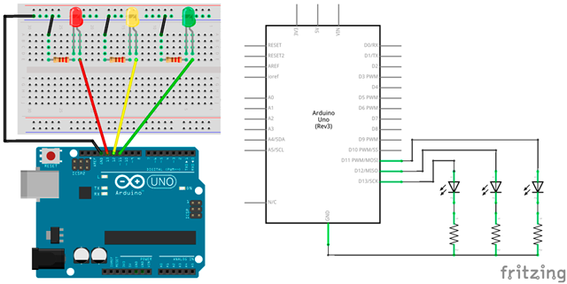

# Práctica 3: Semáforo simple

El objetivo de esta práctica es construir un semáforo simple, es decir, se va a programar un código encargado de simular un semáforo como el que se puede encontrar en cualquier ciudad.


---


<br><br>


## Materiales

- 1 Arduino UNO
- 1 Protoboard
- 4 Latiguillos
- 3 LEDs
- 3 Resistencias de 220Ω (rojo-rojo-marrón)


<br /><br />


## Esquema eléctrico

| Características LED              |        |
| -------------------------------- | ------ |
| Polarizado                       | Sí     |
| Intensidad de Corriente          | 20mA   |
| Tensión Led (verde, ámbar, rojo) | 2.1V   |
| Tensión Led blanco               | 3.3V   |

**Cálculo de la resistencia para el LED**

```
V = 5V - 2.1V = 2.9V
I = 20mA

V = I x R ; R = V / I

R = 2.9V / 0.02A = 145Ω -> 220Ω (por aproximación)
```

Se conectan los LEDs rojo, amarillo y verde a los pines digitales 13, 12 y 11 de la placa de arduino (utilizando su debida resistencia). La patilla larga del LED debe ser conectada al voltaje positivo (ánodo) y la corta al voltaje negativo (cátodo) pasando por la resistencia.




<br /><br />


## Programación en mBlock

Al ejecutar el código se deberán establecer los pines digitales a un valor bajo para inicializar así los LEDs. A continuación se procede a activar y desactivar los diferentes pines simulando el funcionamiento del semáforo.


<br /><br />


## Programación en Arduino

En primer lugar, se configuran los pines digitales 11, 12 y 13 en modo salida (OUTPUT). Esta configuración se establece en la función setup(), ya que solamente se ejecuta una vez. Además, se ha creado la inicialización de los pines a un valor bajo (LOW).

Al ejecutar el código se deberán establecer los pines digitales a un valor bajo para inicializar así los LEDs. A continuación se procede a activar y desactivar los diferentes pines simulando el funcionamiento del semáforo.

```
/**
 * Semáforo simple
 *
 * @author Miguel Ángel Abellán
 * @company Programo Ergo Sum
 * @license Creative Commons. Reconocimiento CompartirIgual 4.0
 */

void setup() {
  pinMode(13, OUTPUT);
  pinMode(12, OUTPUT);
  pinMode(11, OUTPUT);
  digitalWrite(13, LOW);
  digitalWrite(12, LOW);
  digitalWrite(11, LOW);
}

void loop() {
  digitalWrite(13, LOW);
  digitalWrite(11, HIGH);
  delay(5000);
  digitalWrite(11, LOW);
  digitalWrite(12, HIGH);
  delay(1000);
  digitalWrite(12, LOW);
  digitalWrite(13, HIGH);
  delay(5000);
}
```