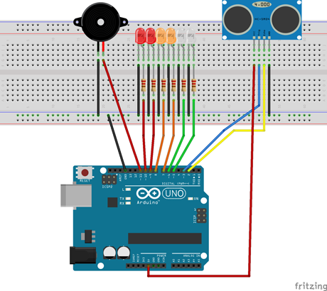
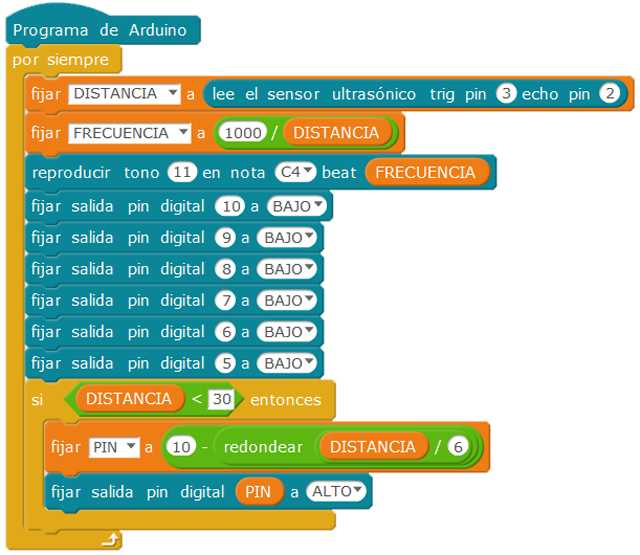

# Sensor de aparcamiento LED

El montaje presentado tiene por objeto que el alumno interactúe con varios componentes del kit arduino. El sistema consiste en un sensor de ultrasonidos, que está conectado a un placa Arduino. Según se la distancia al obstáculo, se va encendiendo una escala de leds de diferentes colores, así como se hace sonar un zumbador  que cambia su frecuencia.

| Autor de la práctica |
| :---                 |
| José Martínez García |

---

  

## Materiales

- 1 Placa de Arduino
- 1 Protoboard
- 2 led color rojo
- 2 led color naranja
- 2 led color blanco
- 6 resistencia 330 ohm
- 1 sensor ultrasonidos HC-SR04
- 1 zumbador pasivo

  

## Esquema eléctrico

Se monta en la protoboard los componentes necesarios, prestando atención a la correcta conexión de los leds, y disponiendo siempre una resistencia en serie. La masa de los leds, zumbador y sensor de ultrasonidos se conectan a una línea de masa de la protoboard, que se conecta a GND de la placa. 

  

## Programación en mBlock

Se crea la variable DISTANCIA, que define la distancia medida por el sensor de ultrasonidos. 
La variable FRECUENCIA se define para que el zumbador varíe su frecuencia de zumbido, de forma inversamente proporcional a la distancia medida.
Con un solo bucle se define como va cambiando el pin de salida a cada led, proporcionalmente a la distancia. Los led se encienden a partir de una distancia inferior a 30 cm, y se va cambiando la salida de tensión del pin 5 al 10, según la distancia se va reduciendo.

