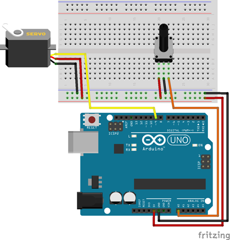

# Servomotor con potenciómetro

El objetivo de esta práctica es regular el ángulo de un servomotor con ayuda de un potenciómetro, es decir, según se gira el potenciómetro desde su posición de resistencia mínima a resistencia máxima, el servomotor girará entre sus valores de 0º y 180º.


---


<br><br>


## Materiales

- 1 Arduino UNO
- 1 Protoboard
- 6 Latiguillos
- 1 Servomotor
- 1 Potenciómetro


<br /><br />


## Esquema eléctrico

| Servo motores      |                  |
| ------------------ | ---------------- |
| Polarizado         | Sí               |
| Tensión operativa  | 4,8V             |
| Rotación           | 0° a 180°        |
| Torque estático    | 4,5V > 1,5Kg/cm  |

| Potenciómetro      |       |
| ------------------ | ----- |
| Polarizado         | Sí    |
| Resistencia mínima | 0Ω    |
| Resistencia máxima | 10KΩ  |
| Precisión          | 5%    |

Conectamos el cable rojo (positivo del servomotor) al pin 5V de la placa de arduino, el cable negro (negativo del servomotor) al pin GND de la placa de arduino y el color amarillo al pin analógico PWM 9 de la placa de arduino. Por otro lado, se conecta el potenciómetro al pin 0 de la entrada analógica de arduino.




<br /><br />


## Programación en mBlock

Al ejecutar el código se calcula el valor analógico del potenciómetro y se almacena en una variable. A continuación se interpola el valor obtenido en la entrada analógica a través del potenciómetro (o-1023) con el valor de salida analógica (0-180) correspondiente a los valores admitidos por el servomotor.


<br /><br />


## Programación en Arduino

En primer lugar, se importa la librería a utilizar <Servo.h> y se inicializa el objeto llamado servomotor. Además se configura el pin analógico PWM 9 a utilizar por el servomotor. Esta configuración se establece en la función setup(), ya que solamente se ejecuta una vez.

Por otro lado, al ejecutar el código se calcula el valor analógico del potenciómetro y se almacena en una variable. A continuación se interpola el valor obtenido en la entrada analógica a través del potenciómetro (o-1023) con el valor de salida analógica (0-180) correspondiente a los valores admitidos por el servomotor.

```
/**
 * Servomotor manual
 * 
 * @author Miguel Ángel Abellán
 * @company Programo Ergo Sum
 * @license Creative Commons. Reconocimiento CompartirIgual 4.0
 */

#include <Servo.h> 

Servo servomotor;

void setup() {
  servomotor.attach(9);
}

void loop() {
  int angulo = analogRead(0);
  angulo = map(angulo, 0, 1023, 0, 180);

  servomotor.write(angulo);
  delay(15);
}
```