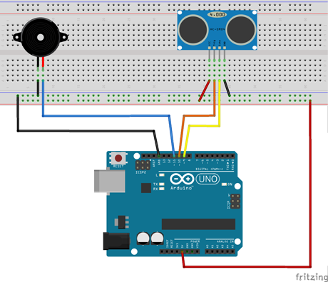
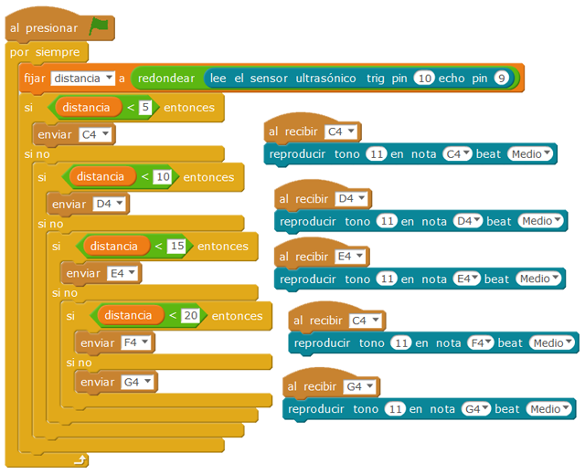

# Theremin electrónico

Con esta práctica queremos obtener diferentes notas musicales dependiendo de la distancia a la que esté el objeto, si el objeto se mueve notaremos como van cambiando las notas, y si el movimiento es el correcto podremos conseguir alguna melodía conocida, puede ser un proyecto desarrollado junto con el departamento de música.

| Autor de la práctica |
| :---                 |
| María Isabel Hernández Monllor |

---

  

## Materiales

- 1 Placa de Arduino
- 1 Protoboard
- 1 Sensor de proximidad por ultrasonidos
- 1 Zumbador
- 6 Latiguillos (macho-macho)

  

## Esquema eléctrico

El montaje es bastante sencillo, el pin del sensor de ultrasonidos Vcc se debe conectar al pin 5V de la placa arduino, el GND del sensor al GND de la placa arduino, y los pines Trig y Echo a los pines 10 y 9 respectivamente de la placa arduino. El zumbador se conecta al pin digital 11 de la placa arduino y al GND.  

  

## Programación en mBlock

Al ejecutar el código se deberá detectar la distancia mediante el bloque que devuelve dicha distancia en centímetro y almacenarla en una variable. Si está a menos de 5 centímetros sonará la nota Do, a 10 centímetros la nota Re, a 15 centímetros la nota Mi, a 20 centímetros la nota Fa y a 20 centímetros o más la nota Sol.

