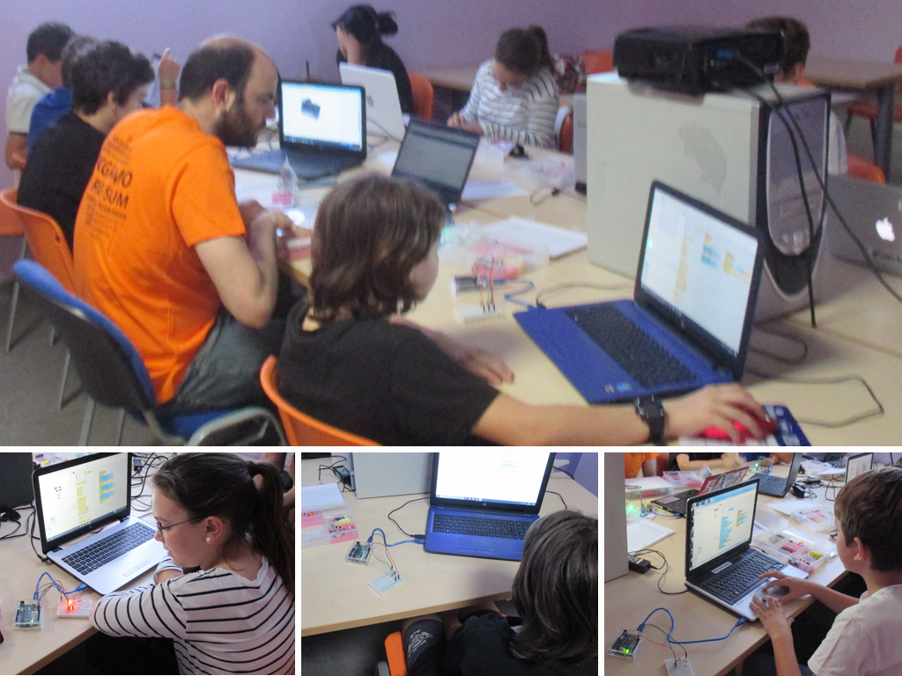

# Prácticas Educativas con Arduino

Este manual está desarrollado por y para docentes interesados en introducir la **programación y robótica en el aula** desde educación secundaria.

Cada una de las prácticas está compuesta por el enunciado de la misma, esquema electrónico con explicación detallada sobre el uso de los componentes electrónicos, y la programación en los lenguajes de programación por bloques y de Arduino IDE.

---

  

## Manual elaborado por

*  Miguel Ángel Abellán ([GitHub](https://github.com/migueabellan) | [Twitter](https://twitter.com/migueabellan))
* ...
* ..

Ayúdanos en la elaboración del manual y aparecerás como autor

  

## Autores de las prácticas

Sistema de puntuación: Cada práctica entregada se multiplicará por el valor del nivel. Los niveles son estimaciones de dificultad en cuanto programación y electrónica.
- Nivel 1/5: 1 Punto
- Nivel 2/5: 2 Puntos
- Nivel 3/5: 3 Puntos
- Nivel 4/5: 4 Puntos
- Nivel 5/5: 5 Puntos

| Puntos | 1/5   | 2/5   | 3/5   | 4/5   | 5/5   | Autor | 
| :---:  | :---: | :---: | :---: | :---: | :---: | :---  |
| 28     |  14   |  4    |  2    |       |       | [Miguel Ángel Abellán](Autores/README.md#miguel-ángel-abellán) |
| 3      |  1    |  1    |       |       |       | Alfredo Velázquez Marín |
| 3      |       |       |  1    |       |       | José Antonio Torrecillas Moya |
| 3      |       |       |  1    |       |       | Sergio Lino Ferrández Gil |
| 3      |       |       |  1    |       |       | Ana Meseguer García |
| 2      |       |  1    |       |       |       | Gerónimo Carbonell Capel |
| 2      |       |  1    |       |       |       | Pascual Banegas Gil |
| 1      |  1    |       |       |       |       | Natalia Fernández de la Cruz López |
| 1      |  1    |       |       |       |       | Pedro José Fernández Martínez |
| 1      |  1    |       |       |       |       | Antonio Martínez Hernández |
| 1      |  1    |       |       |       |       | Heriberto Martínez Martínez |
| 1      |  1    |       |       |       |       | Ana Belén Ayala García |
| 1      |  1    |       |       |       |       | Mariano Noguera López |
| 1      |  1    |       |       |       |       | Celia Martínez Soto |
| 1      |  1    |       |       |       |       | María Isabel Hernández Monllor |
| 1      |  1    |       |       |       |       | Ana María García Caparrós |
| 1      |  1    |       |       |       |       | Guillermo José Gómez Espuny |
| 1      |  1    |       |       |       |       | José Martínez García |
| 1      |  1    |       |       |       |       | Carlota Gómez de Slazar Cateriu |
| 1      |  1    |       |       |       |       | Pablo González Fernández |

Envíanos tu práctica y aparecerás como autor

 

---

 

## Ediciones

* 1ª Edición: Enero, 2017: [Proyecto El Cable Amarillo](https://github.com/ElCableAmarillo/Listado-de-practicas). Financiado por el Fondo Europeo de Desarrollo Regional de la Región de Murcia. 
* 2ª Edición: Febrero, 2018: Nueva documentación teórica sobre programación y electrónica. Adaptaciones mejoradas sobre las prácticas de la Edición 2017 y nuevas prácticas incorporadas al repositorio.

 

---

 

## Licencia

Usted es libre de:

* **Compartir**: Compartir y redistribuir el material en cualquier medio o formato.
* **Adaptar**: Remezclar, transformar y crear a partir del material para cualquier finalidad, incluso comercial.

Bajo las siguientes condiciones:

* **Reconocimiento**: Debe reconocer adecuadamente la autoría, proporcionar un enlace a la licencia e indicar si se han realizado cambios. Puede hacerlo de cualquier manera razonable, pero no de una manera que sugiera que tiene el apoyo del licenciador o lo recibe por el uso que hace.
* **CompartirIgual**: Si remezcla, transforma o crea a partir del material, deberá difundir sus contribuciones bajo la misma licencia que el original.