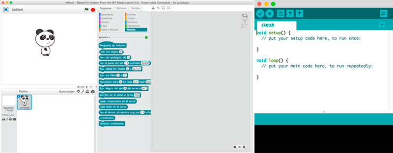

# Software de Arduino

Para programar una tarjeta de Arduino, podemos utilizar diferentes lenguajes y entornos de programación. En este caso vamos a introducir la programación y electrónica con Arduino utilizando los lenguajes de programación por bloques y lenguajes de programación en modo texto.

- [Lenguaje de programación por bloques: mBlock](mblock.md)
- [Lenguaje de programación textual: Arduino IDE](arduino-ide.md)

 

