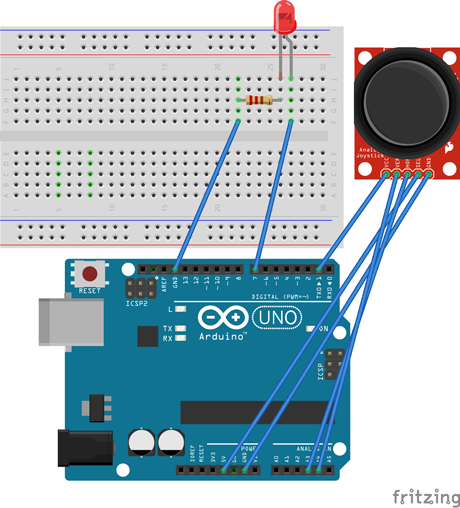
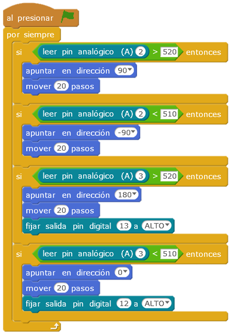

# Evita a los fantasmas

El juego consiste en una chica cazafantasmas que se mueve con un  Joystick, por lo que se une su movimiento al del Joystick. Cuando la chica caza el fantasma este desaparece y un diodo se enciende y vuelve a apagar, sale un clon del fantasma cada segundo.

| Autor de la práctica |
| :---                 |
| Celia Martínez Soto |

---

  

## Materiales

- 1 Placa de Arduino
- 1 Protoboard
- 1 LED rojo 
- 2 resistencias 220ohm
- 1 Joystick
- Latiguillos

  

## Esquema eléctrico

El Joystick tiene 5 pines que se conectan a Gnd, Vcc, entradas anlógicas: A2,A3 y Tx. El diodo a la entrada digital 7, con su resistencia de protección.

  

## Programación en mBlock

Cuando la chica caza el fantasma este desaparece y un diodo se enciende y vuelve a apagar, sale un clon del fantasma cada segundo.

[Descarga el código para mBlock](mblock.sb2)