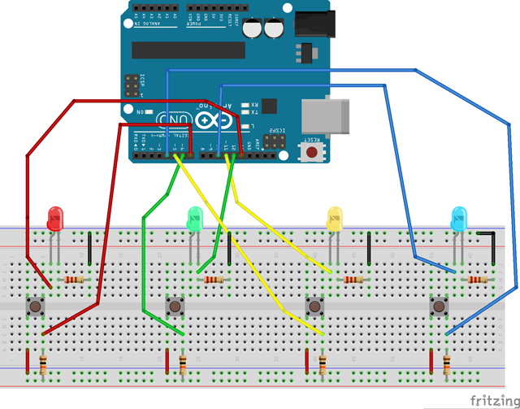
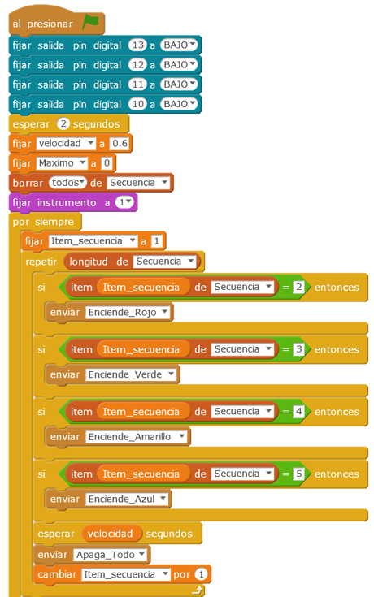

# Juego de Simón

Se pretende implementar una versión del juego Simón, realizado con un Arduino Uno y empleando programación en mBlock. A la vez que la secuencia de luces a repetir se presenta en pantalla, en la placa protoboard se encenderán los leds correspondientes acompañado de un sonido. El jugador introducirá la secuencia solicitada mediante pulsadores ubicados en la protoboard.

| Autores de la práctica |
| :---                 |
| Ana María García Caparrós |
| Guillermo José Gómez Espuny |

---

  

## Materiales

- 1 Placa de Arduino
- 1 Protoboard
- 4 resistencias de 220 Ω
- 4 resistencias de 10 k Ω
- 4 diodos led (rojo, verde, amarillo, azul)
- 4 pulsadores

  

## Esquema eléctrico

Las salidas digitales 13,12, 11y 10 de la placa de Arduino se conectarán a los ánodos de los leds Rojo, Verde, Amarillo y Azul respectivamente. Las entradas digitales 7, 6, 5 y 4 serán controladas por los pulsadores asociados a los colores Rojo, Verde, Amarillo y Azul respectivamente. Los pulsadores se conectarán por uno de sus terminales a + 5Vdc y por el otro a una resistencia  pull-down conectada a GND.

  

## Programación en mBlock

Inicialmente se va rellenado la Lista con la secuencia aleatoria que se genera. Posteriormente  se solicita la entrada de la secuencia a través de los pulsadores y lectura de entradas digitales, empleándose para la activación de los círculos en pantalla el intercambio de mensajes.

[Descarga el código para mBlock](mblock.sb2)