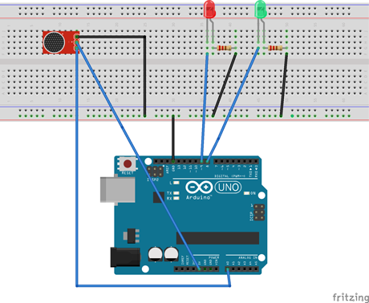
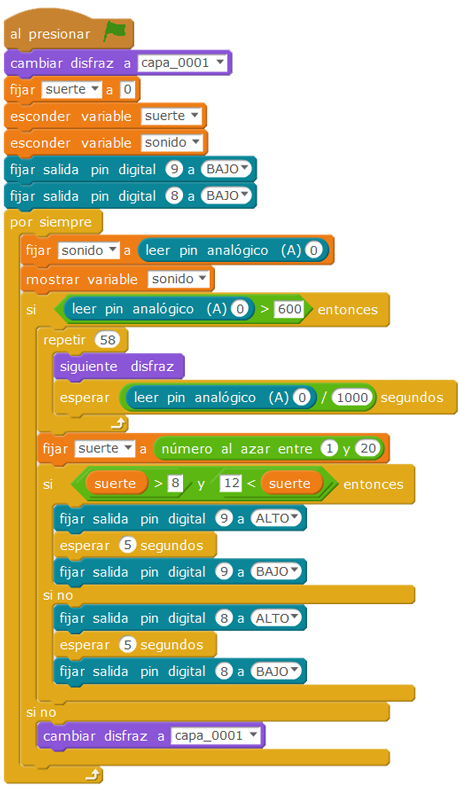

# Make a Wish

Make a wish es un "diente de león" virtual. Soplando en el detector de sonido veremos como las semillas salen volando en la pantalla del ordenador, una luz roja o verde nos indicará si el deseo es concedido o no.

| Autor de la práctica |
| :---                 |
| Natalia Fernández de la Cruz |

---

  

## Materiales

- 1 Placa de Arduino
- 1 Protoboard
- 1 LED rojo 
- 1 LED verde
- 2 resistencias 220ohm
- 1 detector de sonido
- Latiguillos

  

## Esquema eléctrico

La conexión en la protoboard es muy sencilla como se observa.

  

## Programación en mBlock

Para la simulación en la pantalla del ordenador del movimiento de las semillas hemos importado una imagen gif, que se convertirán en los distintos disfraces del objeto.

[Descarga el código para mBlock](mblock.sb2)